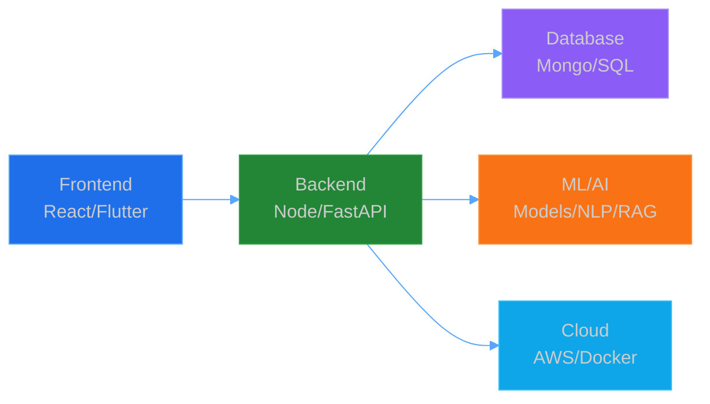

<div align="center">


[](https://git.io/typing-svg)

<p>
  <a href="https://linkedin.com/in/suyash-yv"></a>
  <a href="https://suyashyvportfolio.vercel.app"></a>
</p>


</div>

<!-- CLEAN GRADIENT DIVIDER -->


<div align="center">

## 🚀 About Me

</div>

```ts
const suyash = {
  location: "VIT Vellore, India 🇮🇳",
  education: "B.Tech CSE | CGPA: 9.56/10 🎓",
  role: "Full Stack & ML Engineer",
  currentFocus: ["RAG Pipelines", "NLP Services", "Cloud Architecture"],
  experience: ["Backend @ Csyrus Technologies", "Full Stack @ Algabay AI"],
  askMeAbout: ["Backend Development", "Machine Learning", "System Design"],
  funFact: "I won 2 hackathons back-to-back 🏆"
};
```

<!-- CLEAN GRADIENT DIVIDER -->  <div align="center">
## 🛠️ Tech Arsenal
Languages & Frameworks
<p>  </p>
Backend & APIs
<p>  </p>
Frontend & Mobile
<p>  </p>
Databases & Cloud
<p>  </p>
ML & Data Science
<p>    </p> </div>

<!-- CLEAN GRADIENT DIVIDER -->  <div align="center">

## 📚 My Learning Flow


<!-- CLEAN GRADIENT DIVIDER -->  <div align="center">
## 📊 GitHub Analytics
<p>   </p> <p>  </p> </div>

<!-- CLEAN GRADIENT DIVIDER -->  <div align="center">
## 🎯 Featured Projects

(Neon Card Edition)

</div> 
<div align="center"> 
  <a href="https://github.com/YVSMurthy/bike-rental-system">  </a> 
  <a href="https://github.com/YVSMurthy/web-chat-app">  </a> 
  <a href="https://github.com/YVSMurthy/movie-recommendation-website">  </a> 
  <a href="https://github.com/YVSMurthy/movie-recommendation-model">  </a> 
  <a href="https://github.com/YVSMurthy/expense-tracker">  </a> 
  <a href="https://github.com/YVSMurthy/translator_app">  </a> 
</div>

<!-- CLEAN GRADIENT DIVIDER -->  <div align="center">
🏆 Achievements & Certifications
</div> <table align="center"> <tr> <td align="center">🥇</td> <td><b>1st Place</b> - CodeCortex Hackathon @ VIT</td> <td>Sept 2024</td> </tr> <tr> <td align="center">🥇</td> <td><b>1st Place</b> - Algo Arena Hackathon @ VIT</td> <td>March 2024</td> </tr> <tr> <td align="center">🏅</td> <td><b>Top 12/90+</b> - Hack Battle @ VIT</td> <td>Sept 2023</td> </tr> <tr> <td align="center">📜</td> <td><b>ML Specialization</b> - Stanford/DeepLearning.AI</td> <td>2024</td> </tr> </table>

<div align="center">

<!-- CLEAN GRADIENT DIVIDER -->  <div align="center">
### 🐍 Watch my contributions get eaten!


</div>

 <div align="center">   </div>
